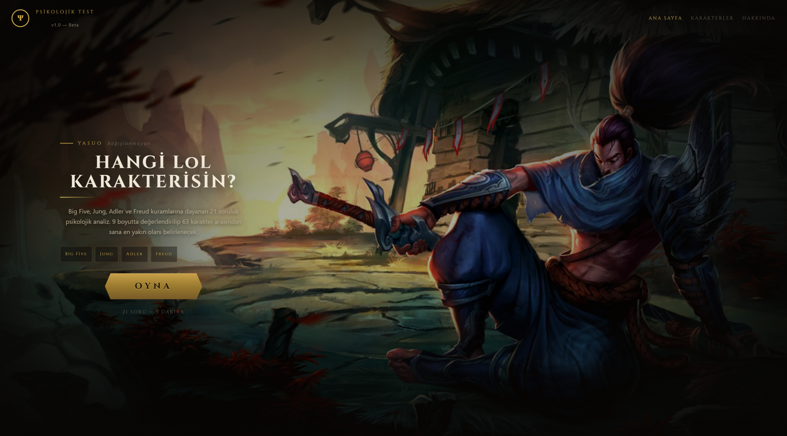
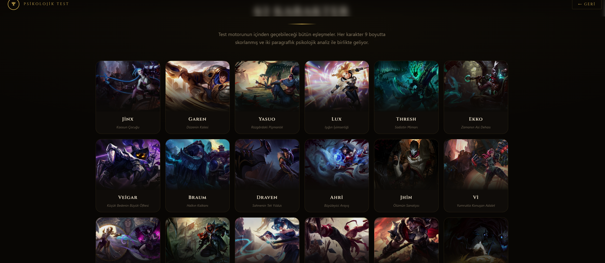
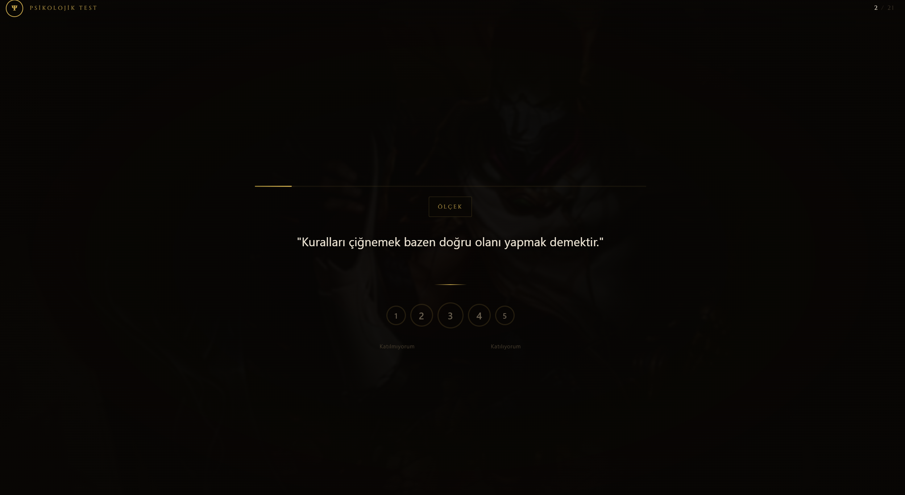

**Which LoL Character Are You?**

A psychological personality analysis conducted through League of Legends characters. The 21-question test combines the four main theoretical frameworks of clinical psychology — Big Five, Freud, Adler, and Jung — to generate a 9-dimensional profile and finds the character among 63 that is closest to the user.

Its purpose is not a fun but superficial “BuzzFeed quiz”; it is to build a serious matching engine based on character profiles that represent real psychological structures and are consistent with the lore.


**Live Demo**

https://lolpersonality.netlify.app/

**Features**

* 21 questions, 4 different question types: scenario, Likert scale, binary choice, ranking  
* Pool of 63 characters: each has a 9-dimensional score and a two-paragraph psychological analysis  
* Centricity penalty algorithm: automatically prevents average-scoring characters from sneaking into the top ranks on every test  
* Adler lifestyle matching: in close results, the user’s dominant lifestyle (dominant, social, receiving, avoiding) acts as the decisive tie-breaker  
* Splash-art background quiz screen: each question features a different champion visual  
* Results screen with comparative bar chart: the user’s profile and the champion’s profile overlaid on top of each other  

**Psychological Framework**  
The test draws from four separate theoretical traditions. Each dimension corresponds to one or more of these traditions.

**Big Five — Five Factor Theory**  
The most empirically supported model in modern personality psychology. It measures personality across five core dimensions: Openness, Conscientiousness, Extraversion, Agreeableness, Neuroticism. Systematized by Costa and McCrae in the 1980s.

**Freud — Structural Model**  
The cornerstone of the psychoanalytic tradition. It divides the psyche into three layers:  

* Id: The impulsive layer. Operates on the pleasure principle; the source of biological needs and instinctual drives.  
* Ego: The mediating structure that operates on the reality principle. Reconciles the Id’s demands with the external world and the Superego.  
* Superego: The internalized moral authority. Represents society’s rules within the individual; it defines the ideal self while also generating feelings of guilt.  
* Sublimation: The transformation of unacceptable drives (e.g., aggression) into culturally valued activities. Considered the most mature defense mechanism.

**Adler — Individual Psychology**  
Alfred Adler’s approach, which broke away from Freud to found its own school. Two core concepts:  

* Striving for superiority: The fundamental motivation to overcome perceived deficiencies and achieve competence. Its healthy form turns into growth and skill; its pathological form becomes the pursuit of dominance over others.  
* Social interest (Gemeinschaftsgefühl): The individual’s capacity for attachment to society and the well-being of others. According to Adler, it is the primary measure of mental health.  

Adler also defines four basic lifestyles — dominant (ruling), social (useful), receiving (dependent), avoiding (evading problems). This test assigns each character a lifestyle and uses it as a tie-breaker in close matches.

**Jung — Analytical Psychology**  
Carl Jung’s typology system, which later formed the foundation of the MBTI. Three core axes:  

* Introversion – Extraversion: The primary orientation of psychic energy. Introverted individuals draw energy from their inner world; extraverted individuals are nourished by external stimuli.  
* Sensing – Intuition: Two different ways of acquiring information. Sensing relies on concrete, immediate, sensory data; intuition processes abstract, probabilistic, pattern-based information.  
* Thinking – Feeling: Two different ways of making decisions. Thinking refers to impersonal logical criteria; feeling relies on subjective values and relational weight.

**9 Dimensions**  
Both every character and every user are scored from 1–10 across the following nine dimensions:

| Code | Name          | Theory      | Meaning                                      |
|------|---------------|-------------|----------------------------------------------|
| O    | Openness      | Big Five    | Openness to new experiences, ideas, and creativity |
| C    | Conscientiousness | Big Five | Discipline, organization, goal-orientation   |
| E    | Extraversion  | Big Five / Jung | Social energy, pursuit of stimulation     |
| A    | Agreeableness | Big Five    | Empathy, cooperation, trust                  |
| N    | Neuroticism   | Big Five    | Emotional instability, tendency toward anxiety |
| TF   | Feeling       | Jung        | Relying on emotion when making decisions     |
| SN   | Intuition     | Jung        | Abstract and pattern-based information processing |
| SI   | Social Interest | Adler     | Attachment to society and others             |
| IS   | Superego      | Freud       | Internalized moral authority, inner standards |

**Algorithm**

1. Question scoring: Each answer adds positive or negative points to the relevant dimensions. Ranking questions use weighted multipliers for each position.  
2. Normalization: Raw total scores are scaled to the 1–10 range using each dimension’s theoretical min-max interval.  
3. Euclidean distance: The distance between the user’s 9-dimensional profile and each character’s profile is calculated.  
4. Centricity penalty: Characters with scores close to the average (e.g., all dimensions between 4–7) are penalized. Without this, “bland” characters would sneak into second place on every test.  
5. Adler tie-breaker: When two characters are extremely close (difference < 0.8), the one that matches the user’s dominant lifestyle is ranked higher.  
6. Top 3: Returns the three closest characters; the main match plus two close alternatives.

**Technology**

* React (functional components, hooks)  
* Inline styles (no external CSS framework)  
* Google Fonts — Cinzel (headings)  
* Riot Games Data Dragon CDN — for champion splash art images  

**Setup**

```bash
npm install
npm run dev
```

Designed as a single-file React application (App.jsx). Can be dropped directly into any Vite or Create React App project.

**Disclaimer**  
This test is not a scientific diagnostic tool. It is an entertainment application inspired by academic psychology theories. League of Legends characters and visuals belong to Riot Games; the project is fan-made and has no commercial purpose. 
DESİGN BY MAZLUM ATİLA

**Images**  


<p align="center">
   <br>
   <br>
  
</p>
